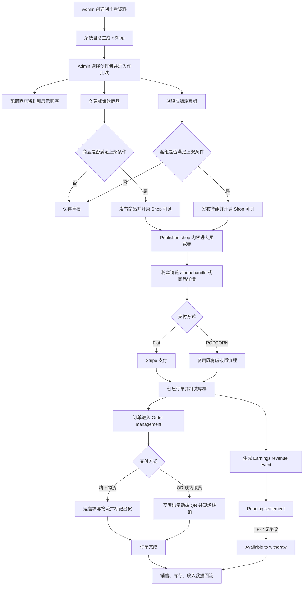
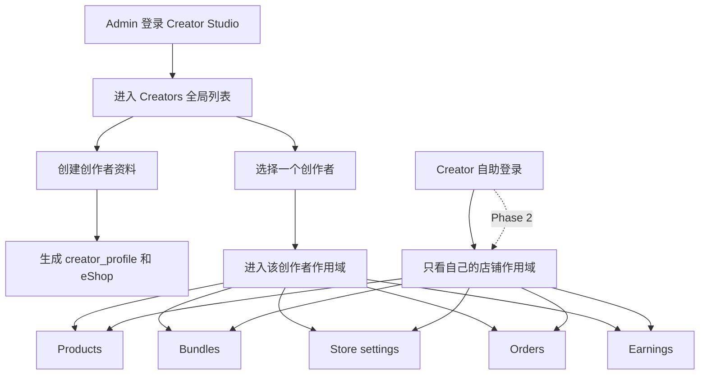
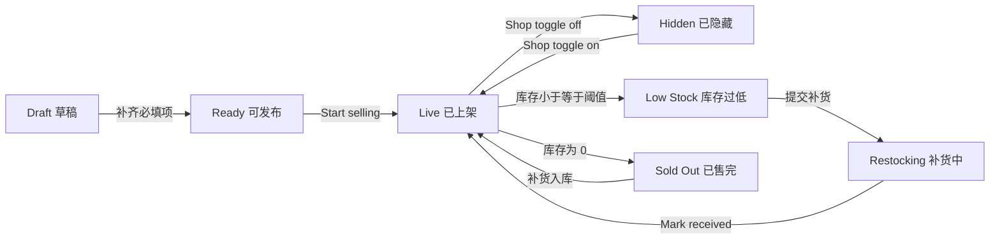
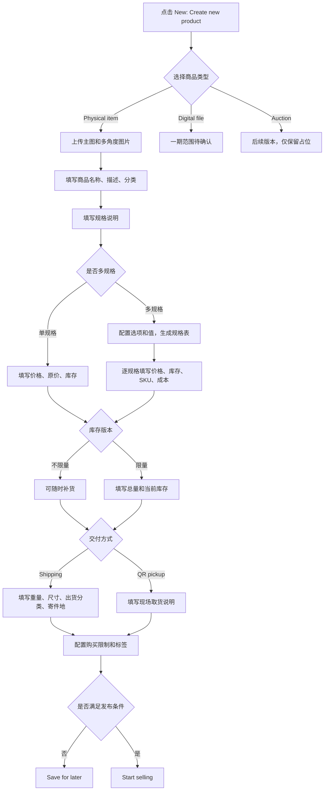
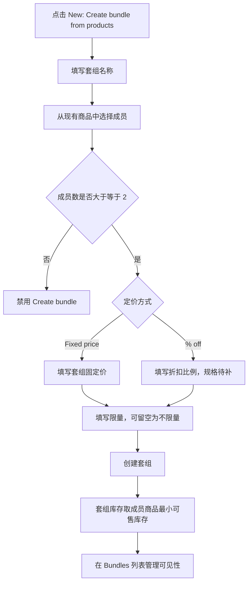
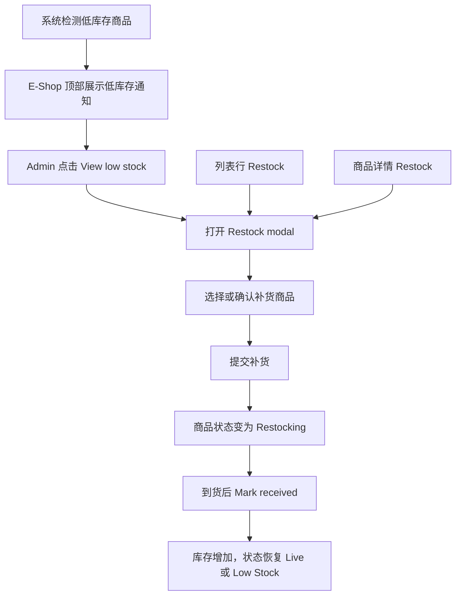
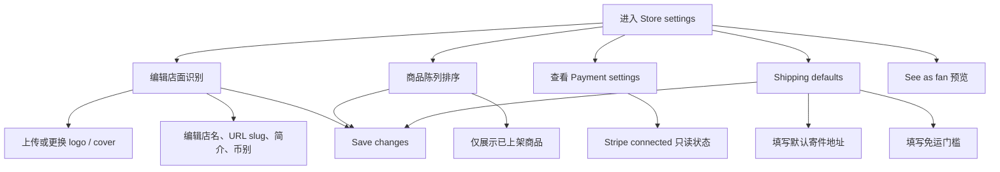
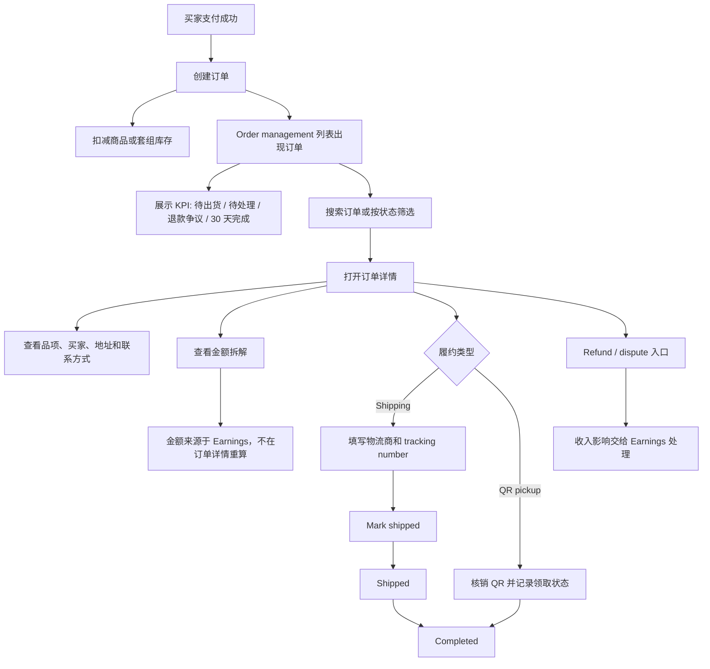
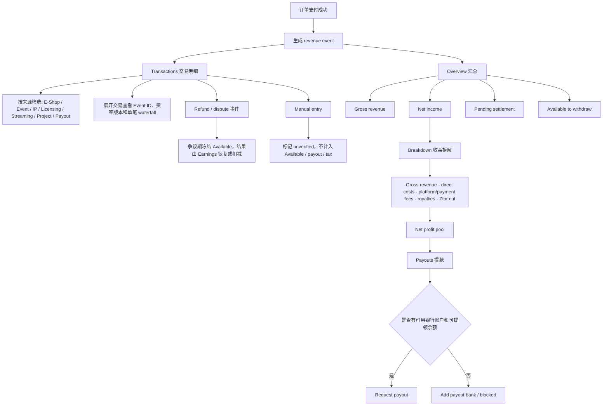

# Ztor Creator Studio e-shop 业务流程图

更新时间：2026-06-16

信息来源：

- 需求页：https://aic-output.vercel.app/ztor/ztor-eshop-wireframe-2026-06-11.html
- 商品管理原型：https://ztor-v2-creator-studio.vercel.app/e-shop.html
- 订单管理原型：https://ztor-v2-creator-studio.vercel.app/orders.html
- 商店设置原型：https://ztor-v2-creator-studio.vercel.app/store-settings.html
- 收入管理原型：https://ztor-v2-creator-studio.vercel.app/earnings.html
- 原型关联页：`create-product.html`、`product-detail.html`、`create-bundle.html`、`order-detail.html`

适用范围：Creator Studio 第一期 e-shop 功能。本文重点描述内部运营后台的业务流、权限流、商品发布流、订单履约流、收入对账流和一期依赖边界。买家端、支付、履约只作为 e-shop 闭环依赖，不在本文展开买家端页面级实现。

## 原型页面对照

| 模块 | 原型入口 | 业务职责 | 与其他模块关系 |
| ---- | -------- | -------- | -------------- |
| 商品管理 | https://ztor-v2-creator-studio.vercel.app/e-shop.html | 管理 Products、Bundles、Auctions 占位、低库存提醒、Shop 可见性、粉丝视角预览 | 商品上架后进入买家端；下单后触发订单和收入事件 |
| 订单管理 | https://ztor-v2-creator-studio.vercel.app/orders.html | 管理订单列表、KPI、搜索、状态筛选、导出、订单详情和履约 | 读取订单金额快照，但金额口径以 Earnings 为准 |
| 商店设置 | https://ztor-v2-creator-studio.vercel.app/store-settings.html | 管理店面资料、URL、简介、币别、商品陈列排序、配送默认值、Stripe 状态 | 影响粉丝端店铺展示和新建商品默认配送配置 |
| 收入管理 | https://ztor-v2-creator-studio.vercel.app/earnings.html | 管理收入总览、交易明细、收益拆解、提现、税务文件 | 是订单金额、退款/争议、结算和提现的唯一金额口径 |

## 1. 一期业务目标

Creator Studio 第一期以“内部运营代创作者管理店铺”为核心：

- Admin 在 Creator Studio 创建创作者资料，系统同步生成该创作者的 eShop。
- Admin 选择某个创作者后，进入该创作者作用域下的商品、套组、订单、收入、商店设置、补货和预览能力。
- 已发布且开启 Shop 可见的商品进入买家端店铺展示。
- 买家下单后生成订单，订单进入履约管理，金额进入 Earnings 统一对账和结算。

范围差异需要产品确认：

- 需求页的 D4 已决策为“实体商品 + bundles only”，排除虚拟商品、音乐、活动票、会员卡。
- 原型中保留了 Digital file 和 Auctions 入口，其中 Auctions 已明确为 later release。
- 本文默认一期实现实体商品和套组；Digital file 仅作为原型遗留入口或后续能力，不进入一期主链路。

## 2. 总体业务闭环

关键约束：

- 商店创建发生在 Creator Studio，创建创作者资料时自动生成，不在 BO 单独建店。
- 只有 Published shop 和已开启 Shop 可见的商品会进入买家端展示。
- Fiat 支付对 Ztor 是新增链路，首期按 Stripe；POPCORN 购买复用既有流程。
- Order management 负责履约、订单状态、退款/争议入口；金额计算和退款/争议的收入影响以 Earnings 为准，订单详情不重新计算。
- 一期 e-shop 需求页写明不做退款；但原型已有退款/争议入口，建议一期至少保留只读或占位入口，真实退款流需业务确认。
- POPCORN 收入兑付为现金以外的结算方案暂缓。
- QR 取货是需求页标记的 blocker，需要进一步明确 token、刷新频率、核销角色和异常处理。

## 3. 角色和权限流

权限口径：

| 角色 | 一期权限 | 说明 |
| ---- | -------- | ---- |
| Admin | 可查看创作者列表；选择创作者后代运营该创作者店铺 | Admin 没有跨创作者的商品全局视图，必须先选择创作者 |
| Creator | Phase 2 自助入口；仅能管理自己的 Product / Orders / Earnings | 一期由内部运营代操作 |
| Buyer | 买家端浏览和购买 | 不进入 Creator Studio |

## 4. 商品发布和可见性状态

状态说明：

- `Draft`：保存但未对粉丝可见。
- `Live`：满足发布条件并开启 Shop 可见。
- `Hidden`：商品仍存在，但不在粉丝端展示。
- `Low Stock`：由库存和低库存阈值推导，用于提醒运营补货。
- `Restocking`：补货流程已提交，等待到货确认。
- `Sold Out`：库存为 0，不可购买。

## 5. 商品创建流程

发布条件建议按原型 readiness 收敛：

- 商品名称、描述、分类。
- 主图。
- 价格。
- 库存或规格库存。
- 实体商品的配送或取货配置。
- 若开启每人限购，需要填写最大购买量。

## 6. 套组创建流程

## 7. 补货和低库存流程

## 8. 店铺设置流程

## 9. 订单管理流程

订单状态口径：

- `Unpaid`：待付款。
- `Paid`：已付款，尚未进入出货处理。
- `To ship`：待出货。
- `Shipped`：已出货。
- `Completed`：已完成。
- `Refund / dispute`：退款或争议中。金额冻结、扣回或恢复均由 Earnings 的交易事件决定。

## 10. 收入管理流程

收入状态口径：

- `Pending`：待结算，保留 T+7 争议期，不可提现。
- `Available`：可提领，Request payout 的资金来源。
- `Payout Requested`：提现申请中。
- `Paid`：已入账或已支付。
- `Failed`：支付或提现失败。
- `Disputed`：争议中，金额从可提领余额冻结。
- `Manual · unverified`：手动补登，不进入可提领、提现和税务文件。

关键约束：

- Pending 不等于 Available。
- 订单详情、商品详情可以展示金额摘要，但金额口径以 Earnings 为唯一来源。
- 只有 settled income 进入净利池和可提领余额。
- 如果净利池为负，分配暂停并向后结转，已支付金额不追回。

## 11. 系统边界和依赖

| 边界 | 业务含义 | 一期处理 |
| ---- | -------- | -------- |
| User DB | Ztor 单一身份体系 | 复用现有用户，不建独立 artist auth |
| creator_profile | 创作者实体，关联 user_id 和 handle | Creator Studio 创建，eShop 自动生成 |
| Commerce module | Shop、Product、Inventory、Order | 复用 Beamco commerce module，API 规格需补齐 |
| Creator Studio gateway | Creator Studio 调 commerce 的服务边界 | 由 Beamco team 负责 |
| Ztor client API gateway | 买家端调 commerce 的服务边界 | 由 Ztor team 负责 |
| Stripe | 新增 Fiat 支付链路 | 首期 Stripe only |
| POPCORN | 既有虚拟币购买流程 | 复用现有链路，只新增 merch 购买场景 |
| QR pickup | 现场取货核销 | 需求已标 blocker，需要方案确认 |
| Order management | 订单履约、状态、买家和出货信息 | 金额只读引用 Earnings，不自行重算 |
| Earnings | 交易事件、收益拆解、提现和税务文件 | e-shop 订单金额统一在此对账和结算 |
| Posts service | Feed 商品卡片 | 新增 product-card attachment，非 Creator Studio 一期核心页面 |

## 12. 待确认问题

1. 一期是否严格按需求页 D4 只做实体商品和套组，还是保留 Digital file 创建能力。
2. Creator registration approval 是否需要一期审批流。
3. Stripe Connect、平台抽佣比例、结算币别和 payout schedule 是否只在 Earnings 维护。
4. QR pickup 的 token 生成、刷新、核销、过期和异常补核销规则。
5. Commerce module API 是否已有 Product、Bundle、Inventory、Order、Store settings 的正式字段规格。
6. 原型有退款/争议入口，但需求页写明 no refunds in v1，一期是完全隐藏、只读占位，还是开放内部处理入口。
7. Earnings 是本期完整收入管理模块，还是只交付 e-shop 订单对账、交易明细和提现最小闭环。
