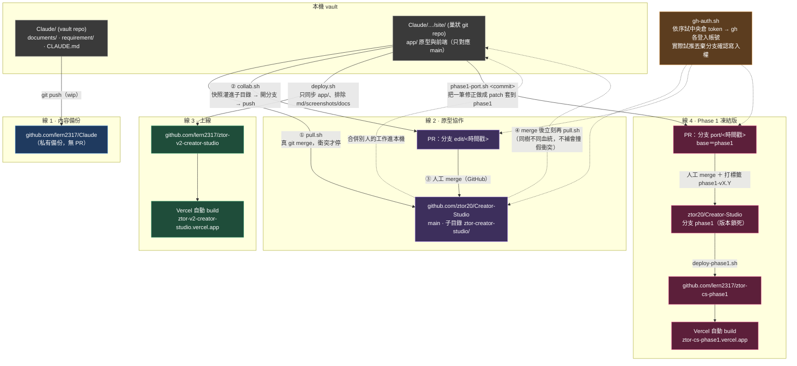

# GitHub 工作流程圖（2026-09-24 現況）

一句話分辨：改規格或筆記 → 直接 push（線 1）；改原型要給人看 → `collab.sh` 開 PR（線 2）；要更新線上網站 → `deploy.sh`（線 3）；修正要進開發用的 Phase 1 凍結版 → `phase1-port.sh` ＋ `deploy-phase1.sh`（線 4）。

**四條線互不觸發**。最常見的誤解是「merge 了 PR 就會上線」——不會，上線一定要另跑線 3。

## 線 2 的完整順序（唯一會弄壞別人工作的一條）

| # | 動作 | 誰做 | 不做會怎樣 |
|---|---|---|---|
| ① | `./pull.sh` | `collab.sh` 自動先跑，不可跳過 | 本機落後時發版會**靜默還原**對方已合併的工作 |
| ② | `./collab.sh "<說明>"` | 你（先問過使用者） | — |
| ③ | 在 GitHub 按 Merge | 有 merge 權的人 | — |
| ④ | 立刻再 `./pull.sh` | 你 | 下次 pull 會在同一段落撞出**假衝突** |

## 線 4 的完整順序（Phase 1 凍結版）

| # | 動作 | 誰做 | 說明 |
|---|---|---|---|
| ① | 改動先照線 2 進 `main` | 你 | 凍結版只收已在 `main` 的修正 |
| ② | `../phase1-port.sh <commit> --check` | 你 | 試套；失敗代表兩邊已分歧，要手動改寫 |
| ③ | `../phase1-port.sh <commit> "<說明>"` | 你（先問過使用者） | 開 `port/` 分支＋PR，同一個 PR 補 `PHASE1-CHANGES.md` 升版 |
| ④ | 在 GitHub 按 Merge，打標籤 `phase1-vX.Y` | 有 merge 權的人 | — |
| ⑤ | `../deploy-phase1.sh` | 你（先問過使用者） | 約 1 分鐘生效，太早看會是舊版 |

凍結版的檔案**不會出現在本機**：腳本都在暫存資料夾 clone `phase1` 分支處理，本機 `site/` 永遠只放 `main`。

## 認證怎麼解析（2026-08-19 改）

`collab.sh`／`pull.sh`／`cleanup.sh`（2026-09-24 起）／`phase1-port.sh` 都走 `gh-auth.sh`：

1. 候選：中央倉 `~/AI/cfg/personal.env` 的 `ZTOR20_GH_TOKEN` → 本機 `gh` 每個已登入帳號
2. `pull.sh` 用 `gh_token_read`（只驗讀、不碰遠端）；`collab.sh` 用 `gh_token_write`
3. `gh_token_write` **實際試推一個 `probe/write-check-$$` 分支**才算數，成功後立刻刪除

**為什麼不查 API**：細粒度 PAT 的讀寫分開授權，`GET /repos/…` 回的 `permissions.push` 是「使用者在 repo 的角色」而非「這把 token 的範圍」——實測角色說可推、真推 403。這題查了三次（08-17／08-18／08-19）才定位，成因之一是舊版 `collab.sh` 把 push 輸出導掉了，現在不導了。

## 兩個容易踩的雷

- **`collab.sh` 送的是工作目錄快照，含未提交編輯**。同機有別的 session 在編輯時，那些半成品會被一起發版。發版前腳本會列出「會被打包的未提交檔案」；要只發已提交內容就用 `PUBLISH_FROM=HEAD ./collab.sh "<說明>"`。
- **合併 PR 不會上線**。線 2 與線 3 完全獨立，上線一律另跑 `deploy.sh`；凍結版同理，要另跑 `deploy-phase1.sh`。
- **中央倉 `ZTOR20_GH_TOKEN` 目前沒有寫入權**（2026-09-24 觀察）。腳本會自動改用本機 `gh` 登入的 yvesliu；`cleanup.sh` 舊版只認中央倉那把，所以一直靜默沒清掉已合併的分支，已修。

## 已刪除（2026-08-19）

`collab-legacy.sh` / `pull-legacy.sh`——舊的「清空再灌＋檔案比對」流程。分支永遠是 main 的線性子代、沒有分歧點，git 因此永遠不報衝突，落後的一方發版會靜默還原同事已合併的工作。留著只是誘人誤跑，沿革看 git 歷史即可。
