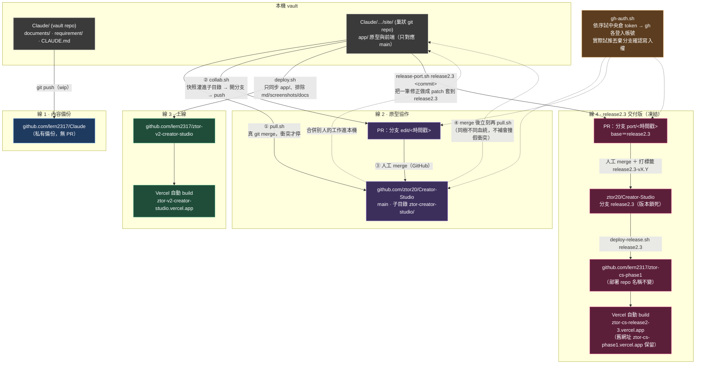

# GitHub 工作流程圖（2026-10-07 現況）

一句話分辨：改規格或筆記 → 直接 push（線 1）；改原型要給人看 → `collab.sh` 開 PR（線 2）；要更新線上網站 → `deploy.sh`（線 3）；修正要進開發用的 release2.3 交付版（原 Phase 1 凍結版）→ `release-port.sh` ＋ `deploy-release.sh`（線 4）。

**四條線互不觸發**。最常見的誤解是「merge 了 PR 就會上線」——不會，上線一定要另跑線 3。

```mermaid
flowchart TB
    subgraph LOCAL["本機 vault"]
        VAULT["Claude/ (vault repo)<br/>documents/ · requirement/ · CLAUDE.md"]
        SITE["Claude/…/site/ (巢狀 git repo)<br/>app/ 原型與前端（只對應 main）"]
    end

    AUTH["gh-auth.sh<br/>依序試中央倉 token → gh 各登入帳號<br/>實際試推丟棄分支確認寫入權"]

    subgraph L1["線 1 · 內容備份"]
        GH1["github.com/lern2317/Claude<br/>（私有備份，無 PR）"]
    end

    subgraph L2["線 2 · 原型協作"]
        MONO["github.com/ztor20/Creator-Studio<br/>main · 子目錄 ztor-creator-studio/"]
        PR["PR：分支 edit/&lt;時間戳&gt;"]
    end

    subgraph L4["線 4 · release2.3 交付版（凍結）"]
        RLS["ztor20/Creator-Studio<br/>分支 release2.3（版本鎖死）"]
        PPR["PR：分支 port/&lt;時間戳&gt;<br/>base＝release2.3"]
        RLSREPO["github.com/lern2317/ztor-cs-phase1<br/>（部署 repo 名稱不變）"]
        RLSVERCEL["Vercel 自動 build<br/>ztor-cs-release2-3.vercel.app<br/>（舊網址 ztor-cs-phase1.vercel.app 保留）"]
    end

    subgraph L3["線 3 · 上線"]
        DREPO["github.com/lern2317/ztor-v2-creator-studio"]
        VERCEL["Vercel 自動 build<br/>ztor-v2-creator-studio.vercel.app"]
    end

    VAULT -->|"git push（wip）"| GH1
    SITE -->|"① pull.sh<br/>真 git merge，衝突才停"| MONO
    MONO -.->|"合併別人的工作進本機"| SITE
    SITE -->|"② collab.sh<br/>快照灌進子目錄 → 開分支 → push"| PR
    PR -->|"③ 人工 merge（GitHub）"| MONO
    MONO -.->|"④ merge 後立刻再 pull.sh<br/>（同樹不同血統，不補會撞假衝突）"| SITE
    SITE -->|"deploy.sh<br/>只同步 app/、排除 md/screenshots/docs"| DREPO
    DREPO --> VERCEL
    SITE -->|"release-port.sh release2.3 &lt;commit&gt;<br/>把一筆修正做成 patch 套到 release2.3"| PPR
    PPR -->|"人工 merge ＋ 打標籤 release2.3-vX.Y"| RLS
    RLS -->|"deploy-release.sh release2.3"| RLSREPO
    RLSREPO --> RLSVERCEL

    AUTH -.-> MONO
    AUTH -.-> PR
    AUTH -.-> PPR

    classDef line1 fill:#1f3a5f,stroke:#4a90d9,color:#fff
    classDef line2 fill:#3d2f5c,stroke:#9b7ede,color:#fff
    classDef line3 fill:#1f4d3a,stroke:#4caf82,color:#fff
    classDef local fill:#3a3a3a,stroke:#888,color:#fff
    classDef auth fill:#5c3d1f,stroke:#d99a4a,color:#fff
    classDef line4 fill:#5c1f3a,stroke:#d94a8a,color:#fff
    class GH1 line1
    class MONO,PR line2
    class DREPO,VERCEL line3
    class VAULT,SITE local
    class AUTH auth
    class RLS,PPR,RLSREPO,RLSVERCEL line4
```

## 線 2 的完整順序（唯一會弄壞別人工作的一條）

| # | 動作 | 誰做 | 不做會怎樣 |
|---|---|---|---|
| ① | `./pull.sh` | `collab.sh` 自動先跑，不可跳過 | 本機落後時發版會**靜默還原**對方已合併的工作 |
| ② | `./collab.sh "<說明>"` | 你（先問過使用者） | — |
| ③ | 在 GitHub 按 Merge | 有 merge 權的人 | — |
| ④ | 立刻再 `./pull.sh` | 你 | 下次 pull 會在同一段落撞出**假衝突** |

② 開 PR 時，`collab.sh` 會讀這次新增的 `UI-CHANGES.md` 條目的 `**標籤**` 行（`release2.3`、`release2.4`），貼成 GitHub PR 標籤，並在 PR 內文列出新增條目的標題；標到已凍結的交付版時，結尾提醒用 `release-port.sh` 搬。標籤判斷規則見 [WORKFLOW.md](WORKFLOW.md) §5。

## 線 4 的完整順序（release2.3 交付版）

| # | 動作 | 誰做 | 說明 |
|---|---|---|---|
| ① | 改動先照線 2 進 `main` | 你 | 凍結版只收已在 `main` 的修正 |
| ② | `../release-port.sh release2.3 <commit> --check` | 你 | 試套；失敗代表兩邊已分歧，要手動改寫 |
| ③ | `../release-port.sh release2.3 <commit> "<說明>"` | 你（先問過使用者） | 開 `port/` 分支＋PR（base＝`release2.3`，自動掛同名標籤），同一個 PR 補 `RELEASE2.3-CHANGES.md` 升版；`ASSUMPTIONS.md`／`UI-CHANGES.md`／`requirements-map.md` 三份紀錄檔內建排除 |
| ④ | 在 GitHub 按 Merge，打標籤 `release2.3-vX.Y` | 有 merge 權的人 | 舊標籤 `phase1-v1.0`～`phase1-v1.3` 保留不動，從 `release2.3-v1.4` 起用新名稱 |
| ⑤ | `../deploy-release.sh release2.3` | 你（先問過使用者） | 約 1 分鐘生效，太早看會是舊版；新交付版要先在腳本的 `release_target` 補一筆部署目標 |

凍結版的檔案**不會出現在本機**：腳本都在暫存資料夾 clone `release2.3` 分支處理，本機 `site/` 永遠只放 `main`。

網址：`https://ztor-cs-release2-3.vercel.app` 是主要網址，舊網址 `https://ztor-cs-phase1.vercel.app` 保留繼續有效。部署 repo `lern2317/ztor-cs-phase1` 與 Vercel 專案 `ztor-cs-phase1` 名稱不變（改名會斷自動部署）。完整規則見 [WORKFLOW.md](WORKFLOW.md) §5。

## 認證怎麼解析（2026-08-19 改）

`collab.sh`／`pull.sh`／`cleanup.sh`（2026-09-24 起）／`release-port.sh` 都走 `gh-auth.sh`：

1. 候選：中央倉 `~/AI/cfg/personal.env` 的 `ZTOR20_GH_TOKEN` → 本機 `gh` 每個已登入帳號
2. `pull.sh` 用 `gh_token_read`（只驗讀、不碰遠端）；`collab.sh` 用 `gh_token_write`
3. `gh_token_write` **實際試推一個 `probe/write-check-$$` 分支**才算數，成功後立刻刪除

**為什麼不查 API**：細粒度 PAT 的讀寫分開授權，`GET /repos/…` 回的 `permissions.push` 是「使用者在 repo 的角色」而非「這把 token 的範圍」——實測角色說可推、真推 403。這題查了三次（08-17／08-18／08-19）才定位，成因之一是舊版 `collab.sh` 把 push 輸出導掉了，現在不導了。

## 兩個容易踩的雷

- **`collab.sh` 送的是工作目錄快照，含未提交編輯**。同機有別的 session 在編輯時，那些半成品會被一起發版。發版前腳本會列出「會被打包的未提交檔案」；要只發已提交內容就用 `PUBLISH_FROM=HEAD ./collab.sh "<說明>"`。
- **合併 PR 不會上線**。線 2 與線 3 完全獨立，上線一律另跑 `deploy.sh`；凍結版同理，要另跑 `deploy-release.sh <release>`。
- **中央倉 `ZTOR20_GH_TOKEN` 目前沒有寫入權**（2026-09-24 觀察）。腳本會自動改用本機 `gh` 登入的 yvesliu；`cleanup.sh` 舊版只認中央倉那把，所以一直靜默沒清掉已合併的分支，已修。

## 已刪除（2026-08-19）

`collab-legacy.sh` / `pull-legacy.sh`——舊的「清空再灌＋檔案比對」流程。分支永遠是 main 的線性子代、沒有分歧點，git 因此永遠不報衝突，落後的一方發版會靜默還原同事已合併的工作。留著只是誘人誤跑，沿革看 git 歷史即可。
