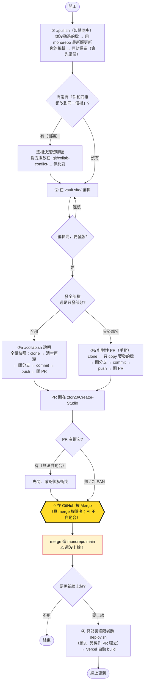

# ztor Creator Studio · site/ 工作流程與檔案結構

這份是 `site/`（原型站台）的總覽：檔案結構、檔案之間的關係、改東西會觸發什麼、以及發版流程。發版那段黃色關卡 = **由具 merge 權限者在 GitHub 按 Merge**。

---

## 1. 檔案結構

```
site/                         ← 獨立 git repo → 共用 monorepo ztor20/Creator-Studio
│
├─ 〔共編規則 + 工具〕
│  ├─ CLAUDE.md / AGENTS.md   開工→編輯→發版規則（同一份，分別給 Claude / Codex）
│  ├─ README.md               版本與治理
│  ├─ WORKFLOW.md             ← 本檔
│  ├─ collab.sh               發版：全量快照 → 開 PR
│  └─ pull.sh                 同步：智慧三方，拉同事最新版
│
└─ r2.1/                      ← 原型站台（唯一版本）
   ├─ *.html ×29              產品頁面
   ├─ js/ ×11                 共用前端腳本：theme / i18n / icons(+icons-all) / sidebar / chart / hero / reveal / components / scenario / devtools
   ├─ partials/ ×6 js         modal / wizard 片段
   ├─ ds-components/ ×63 css  設計系統元件（一元件一檔）
   ├─ *.md ×7                 規格文件：SPEC / BUILD-SPEC / ASSUMPTIONS / design-system.md / UI-CHANGES / component-library / requirements-map
   ├─ fonts/                  自架字型（woff2）
   ├─ images/                 hero 等視覺資產
   ├─ screenshots/            開發截圖（本機保留、不進 repo）
   └─ docs/                   雜項文件

（r2.1_test/ = 本機測試暫存區，不追蹤、不發版）
```

**29 個頁面分區：** 入口 `index` ｜ E-Shop `e-shop / store-settings / tier-settings / product-detail / orders / order-detail` ｜ 收益 `earnings / request-payout` ｜ IP `ip-market / my-ip / ip-detail / register-ip` ｜ 專案活動 `projects / project-detail / events / event-detail` ｜ 粉絲 `fans-crm / fan-detail` ｜ 建立流程 `create-product / create-auction / create-bundle / create-event / create-project` ｜ 詳情 `auction-detail / bundle-detail` ｜ 設定 `settings` ｜ 設計系統 `design-system.html`

---

## 2. 檔案之間的關係（依賴鏈）

由底層往上：

1. **Token 層** — `ds-components/_tokens.css`：所有設計 token（顏色 / 字級 / 間距 / 圓角 / 陰影 / 深色）。**每頁都載**。元件全靠 `var(--token)`，所以改這裡 = 全站換膚。
2. **字型** — `ds-components/fonts.css`（@font-face）→ `fonts/*.woff2`。
3. **元件層** — `ds-components/{name}.css`（63 個，一元件一檔，皆吃 token）。
4. **共用腳本** — 每頁載入：`js/theme.js`（主題）、`js/i18n.js`（中英切換，配 `data-en`/`data-zh`）、`js/icons.js`+`js/icons-all.js`（圖示 registry → applyIcons，配 `data-lucide`）、`js/sidebar.js`（app-shell 導覽）、`shared.css`；其餘 `js/chart.js` / `js/hero.js` / `js/reveal.js` 等按需。
5. **頁面層** — `*.html` = 「共用 chrome + 它用到的元件 CSS 子集 + 它用到的 `partials/*.js`」。
6. **元件展示** — `design-system.html` 載入**同一份** `ds-components/*.css` 來展示 → 是元件的**單一真相來源**（設計師檢視元件只看它）。
7. **文件層** — `design-system.md`（規格）、`component-library.md`、`requirements-map.md`、`SPEC` / `BUILD-SPEC` / `ASSUMPTIONS` / `UI-CHANGES`。

載入順序：`theme.js`（早，防閃白）→ `_tokens` → `fonts` → 元件 CSS → `shared.css` → `icons / i18n / sidebar` + 頁面 partials。

---

## 3. 改東西會觸發哪些流程

| 你改了… | 必須連帶做 |
|---|---|
| **Token**（`_tokens.css`） | 影響全站所有元件 + 頁面 → 跨頁、跨深色目視驗證 |
| **寫出可重用樣式** | 第一次就 promote 成 `ds-components/{name}.css`，不留在頁面 `<style>` |
| **某個元件**（`ds-components/X.css`） | ① 同步 `design-system.html`（demo 卡 + TOC）② 同步 `design-system.md` 條目 ③ grep 所有用到的頁、一起改（共用元件改一次、同步全部 consumer） |
| **i18n 字串** | 加 `data-en` / `data-zh` 成對 + `js/i18n.js` 字典 |
| **新圖示** | 先在 `js/icons.js` registry 註冊，再用 `data-lucide` |
| **新字型** | 放 `fonts/` + `fonts.css` 加 @font-face |
| **任何收尾** | 跑 `check_ds_sync.py "site/r2.1"`（6 項：元件 CSS 都進 DS 頁／頁面用的 CSS DS 也有／資產 `?v=` 一致／元件有 demo／無裸色 token／TOC 錨點），全 PASS；再 append `UI-CHANGES.md`、同步 `requirements-map.md` |

> 規則出處：規則摘要在專案 `CLAUDE.md`「site/ 原型編修鐵律」；詳細 Edit Cycle 在 `project-ui-creator` skill；檢查由該 skill 的 `scripts/check_ds_sync.py`；**收尾守門員**是個 Stop hook，想結束一輪時自動跑 check，FAIL 就擋住。

---

## 4. 發版流程（黃色 = 你要去 GitHub 按 Merge）



**重點：**
- **① 開工前先 `./pull.sh`**：智慧三方同步——你沒動過的檔自動更新、你的編輯保留，只有「你和同事改到同一檔」才列出來請你決定（覆寫前都先備份）。`collab.sh` 是全量發版，本機落後就會洗掉他人剛合併的改動，所以先 pull。
- **⭐ Merge 關卡**：開好 PR 後，由具 merge 權限者在 GitHub 按 Merge；AI 不自動合，PR 有衝突先問。
- **Merge ≠ 上線**：合併只進 monorepo，線上站不會變；要更新線上一定要另跑 `deploy.sh`（線3，獨立）。
- **只發部分檔別用 collab.sh**：它全量覆蓋；改用「針對性 PR」只送要發的檔。

> 另一條線（不在此圖）：`documents/`、`requirement/` 等 `site/` 以外的內容，是一般 `git push`，**無 PR、無 merge 關卡**。
