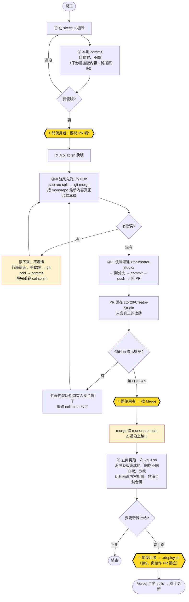

# ztor Creator Studio · site/ 工作流程與檔案結構

這份是 `site/`（原型站台）的總覽：檔案結構、檔案之間的關係、改東西會觸發什麼、以及發版流程。發版流程圖裡的**黃色關卡＝要先問使用者才做**（開 PR／Merge／上線）；本地 commit 不在此列，自動做。

> 2026-07-26 起同步機制改成真正的 `git merge`（原本是自製的檔案比對＋整包覆蓋，兩人並行會靜默還原對方的工作）。詳見 §4。

---

## 1. 檔案結構

```
site/                         ← 獨立 git repo，經 git subtree 與 monorepo ztor20/Creator-Studio 對齊
│
├─ 〔共編規則 + 工具〕
│  ├─ CLAUDE.md / AGENTS.md   開工→編輯→發版規則（同一份，分別給 Claude / Codex）
│  ├─ README.md               版本與治理
│  ├─ WORKFLOW.md             ← 本檔
│  ├─ pull.sh                 同步：真 git merge（subtree split → merge），有衝突會擋
│  ├─ collab.sh               發版：強制先 pull → 快照進子目錄 → 開 PR
│  ├─ devserver.py            本機預覽 server（送 no-store，取代 python -m http.server）
│  └─ *-legacy.sh             2026-07-26 前的舊版 pull/collab（清空再灌），備查用
│
└─ r2.1/                      ← 原型站台（唯一版本）
   ├─ *.html ×40              產品頁面 ＋ design-system.html
   ├─ js/ ×15                 共用前端腳本：theme / i18n / icons(+icons-all) / sidebar / chart / hero /
   │                          reveal / components / scenario / devtools / projects-store / products-store …
   ├─ partials/ ×17           modal / wizard / finance-overview 等片段（html + js）
   ├─ ds-components/ ×92 css  設計系統元件（一元件一檔）
   ├─ *.md ×12                規格與治理：SPEC / BUILD-SPEC / ASSUMPTIONS / STYLE-DECISIONS /
   │                          design-system.md / ds-index.md / UI-CHANGES(+archive) /
   │                          component-library / requirements-map / feature-scope-map
   ├─ fonts/                  自架字型（woff2）
   ├─ images/                 專案／商品／IP 視覺資產
   ├─ screenshots/            開發截圖（本機保留、不進 repo）
   ├─ scratch/                本機暫存，不追蹤、不發版
   └─ docs/                   雜項文件（deploy.sh 排除，不上線）
```

**29 個頁面分區：** 入口 `index` ｜ E-Shop `e-shop / store-settings / tier-settings / product-detail / orders / order-detail` ｜ 收益 `earnings / request-payout` ｜ IP `ip-market / my-ip / ip-detail / register-ip` ｜ 專案活動 `projects / project-detail / events / event-detail` ｜ 粉絲 `fans-crm / fan-detail` ｜ 建立流程 `create-product / create-auction / create-bundle / create-event / create-project` ｜ 詳情 `auction-detail / bundle-detail` ｜ 設定 `settings` ｜ 設計系統 `design-system.html`

---

## 2. 檔案之間的關係（依賴鏈）

由底層往上：

1. **Token 層** — `ds-components/_tokens.css`：所有設計 token（顏色 / 字級 / 間距 / 圓角 / 陰影 / 深色）。**每頁都載**。元件全靠 `var(--token)`，所以改這裡 = 全站換膚。
2. **字型** — `ds-components/fonts.css`（@font-face）→ `fonts/*.woff2`。
3. **元件層** — `ds-components/{name}.css`（63 個，一元件一檔，皆吃 token）。
4. **共用腳本** — 每頁載入：`js/theme.js`（主題）、`js/i18n.js`（中英切換，配 `data-en`/`data-zh`）、`js/icons.js`+`js/icons-all.js`（圖示 registry → applyIcons，配 `data-lucide`）、`js/sidebar.js`（app-shell 導覽）、`shared.css`；其餘 `js/chart.js` / `js/hero.js` / `js/reveal.js` 等按需。
5. **頁面層** — `*.html` = 「共用 chrome + 它用到的元件 CSS 子集 + 它用到的 `partials/*.js`」。
6. **元件展示** — `design-system.html` 載入**同一份** `ds-components/*.css` 來展示 → 是元件的**單一真相來源**（設計師檢視元件只看它）。
7. **文件層** — `design-system.md`（規格）、`component-library.md`、`requirements-map.md`、`SPEC` / `BUILD-SPEC` / `ASSUMPTIONS` / `UI-CHANGES`。

載入順序：`theme.js`（早，防閃白）→ `_tokens` → `fonts` → 元件 CSS → `shared.css` → `icons / i18n / sidebar` + 頁面 partials。

---

## 3. 改東西會觸發哪些流程

| 你改了… | 必須連帶做 |
|---|---|
| **Token**（`_tokens.css`） | 影響全站所有元件 + 頁面 → 跨頁、跨深色目視驗證 |
| **寫出可重用樣式** | 第一次就 promote 成 `ds-components/{name}.css`，不留在頁面 `<style>` |
| **某個元件**（`ds-components/X.css`） | ① 同步 `design-system.html`（demo 卡 + TOC）② 同步 `design-system.md` 條目 ③ grep 所有用到的頁、一起改（共用元件改一次、同步全部 consumer） |
| **i18n 字串** | 加 `data-en` / `data-zh` 成對 + `js/i18n.js` 字典 |
| **新圖示** | 先在 `js/icons.js` registry 註冊，再用 `data-lucide` |
| **新字型** | 放 `fonts/` + `fonts.css` 加 @font-face |
| **任何收尾** | 跑 `check_ds_sync.py "site/r2.1"`（**11 項**：元件 CSS 都進 DS 頁／頁面用的 CSS DS 也有／資產版本一致／元件有 demo／元件無裸色／TOC 錨點／token 真實性／DS 級覆寫不留頁面／md↔html 同步／頁面 token 棘輪／零消費元件），FAIL 修掉；再 append `UI-CHANGES.md` 最上方、同步 `requirements-map.md` |
| **要清瀏覽器快取** | **平常不用做**——資產版本已凍結成固定的 `?v=r2.1`。線上由 Vercel 的 `must-revalidate` ＋ ETag 負責，本機由 `devserver.py` 的 `no-store` 負責。真要強制清才手動跑一次 `bump_ver.py "site/r2.1" <新字串>` |

> 規則出處：規則摘要在專案 `CLAUDE.md`「site/ 原型編修鐵律」；詳細 Edit Cycle 在 `project-ui-creator` skill；檢查由該 skill 的 `scripts/check_ds_sync.py`；**收尾守門員**是個 Stop hook，想結束一輪時自動跑 check，FAIL 就擋住。

---

## 4. 發版流程（黃色 = 要先問使用者才做）

2026-07-26 大改：同步從「自製檔案比對」換成**真正的 `git merge`**，發版前強制先同步。動機與舊版的壞法見本節最後。


```mermaid
flowchart TD
    A(["開工"]) --> B["① 在 site/r2.1 編輯"]
    B --> B2["② 本地 commit<br/>自動做、不問<br/>（不影響發版內容，純還原點）"]
    B2 --> E{"要發版?"}
    E -- "還沒" --> B
    E -- "要" --> F{{"⭐ 問使用者：要開 PR 嗎?"}}
    F --> G["③ ./collab.sh 說明"]
    G --> G1["③-0 強制先跑 ./pull.sh<br/>subtree split → git merge<br/>把 monorepo 最新內容真正合進本機"]
    G1 --> C{"有衝突?"}
    C -- "有" --> C1["停下來、不發版<br/>行級衝突，手動解 → git add → commit<br/>解完重跑 collab.sh"]
    C1 --> G1
    C -- "沒有" --> G2["③-1 快照灌進 ztor-creator-studio/<br/>→ 開分支 → commit → push → 開 PR"]
    G2 --> I["PR 開在 ztor20/Creator-Studio<br/>只含真正的改動"]
    I --> J{"GitHub 顯示衝突?"}
    J -- "有" --> J1["代表你發版期間有人又合併了<br/>重跑 collab.sh 即可"]
    J1 --> G1
    J -- "無 / CLEAN" --> K{{"⭐ 問使用者 → 按 Merge"}}
    K --> L["merge 進 monorepo main<br/>⚠ 還沒上線！"]
    L --> P1["④ 立刻再跑一次 ./pull.sh<br/>消除發版造成的「同樹不同血統」分歧<br/>此刻兩邊內容相同，無痛自動合併"]
    P1 --> M{"要更新線上站?"}
    M -- "不用" --> N(["結束"])
    M -- "要上線" --> O{{"⭐ 問使用者 → ./deploy.sh<br/>（線3，與協作 PR 獨立）"}}
    O --> P(["Vercel 自動 build → 線上更新"])

    classDef gate fill:#FFDB29,stroke:#171717,stroke-width:3px,color:#171717;
    classDef warn fill:#FFF3CD,stroke:#DA314A,stroke-width:1px,color:#171717;
    class F,K,O gate;
    class L,C1 warn;
```

**四個關卡，三個要問：**

| 步驟 | 要問嗎 | 為什麼 |
|---|---|---|
| 本地 commit | **不用** | 純本機還原點。`collab.sh` 送的是工作目錄快照（含未提交編輯），有沒有 commit 不影響發版內容 |
| 開 PR（`collab.sh`） | **要** | 推到協作 repo，別人看得到 |
| Merge | **要** | 進 main |
| 上線（`deploy.sh`） | **要** | 對外 |

**四個重點：**

- **③-0 的強制同步跳不掉**，這是「不會洗掉別人工作」的唯一保證。同步過後，本機必然 ＝ 遠端 ⊕ 你的改動，快照送出去就不可能還原別人的東西。
- **衝突現在是行級的、而且會擋。** `pull.sh` 撞到同一行就停，列出檔案要你解。純 `?v=` 版本字串的衝突沒有語意，腳本自動以本機版收掉。
- **④ merge 後那次 pull 不能省。** 發版是把快照灌進 monorepo、送出去的不是你的 commit 物件，所以 merge 完 main 那筆提交跟本機 HEAD 是「同樹不同血統」，兩邊立刻分歧。當下內容相同、pull 無痛；一旦先改了東西再 pull，同一段落就會撞出假衝突（2026-07-26 實測踩過）。
- **Merge ≠ 上線。** 合併只進 monorepo，線上站不會變；要更新線上一定要另跑 `deploy.sh`。

### 為什麼要大改（舊流程的壞法）

舊 `collab.sh` 是：clone 最新 main → 清空子目錄 → 灌入本機整包快照 → **從最新 main 開分支**。分支永遠是 main 的線性子代、沒有分歧點，所以 **git 永遠不會報衝突**——本機任何一個落後的檔，在 PR 裡都長成「你刻意改成這樣」，merge 後同事已合併的工作就被**靜默還原**，而且 PR 一律顯示 CLEAN、沒有任何警告。

三種具體壞法：

1. **靜默還原**：B 改了某支 CSS 並合併，A 沒同步就發版 → 那支 CSS 被還原成舊版
2. **新增檔被刪**：B 加了新元件與圖片，A 本機沒有 → 整包灌進去等於刪除
3. **空窗期**：A 就算先同步了，接著改兩小時，期間 B 合併的東西一樣會被洗掉

改成真 merge 後：1、2 由 `pull.sh` 的三方合併擋下；3 由「`collab.sh` 內建同步 ＋ GitHub 對落後基準做真三方比對」擋下。

舊版腳本保留在 `pull-legacy.sh` / `collab-legacy.sh` 備查。一次性的歷史接合（`git subtree split` ＋ `-s ours` graft）在 site/ 留了安全點 tag `pre-subtree-graft-20260726`。

> 另一條線（不在此圖）：`documents/`、`requirement/` 等 `site/` 以外的內容，是一般 `git push`，**無 PR、無 merge 關卡**。
