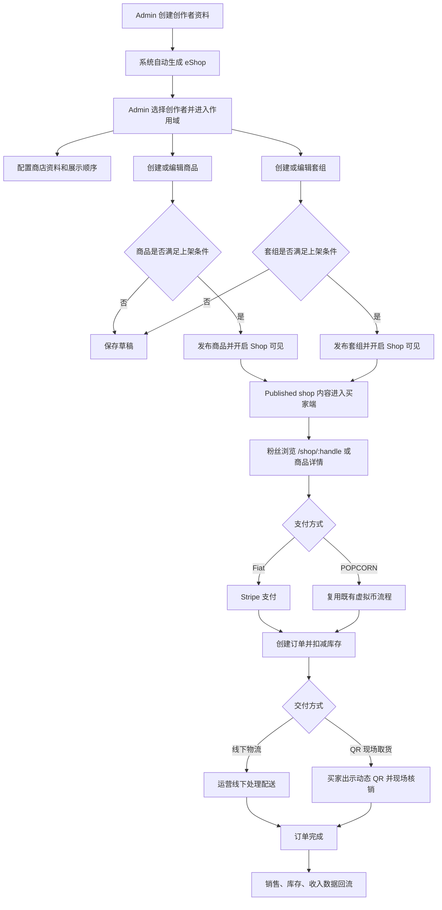
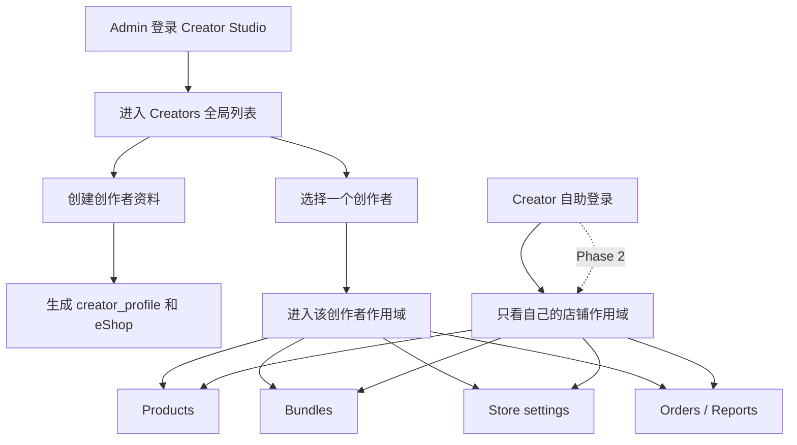
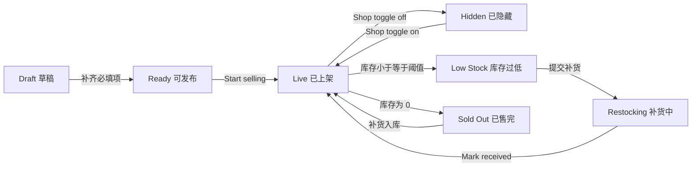
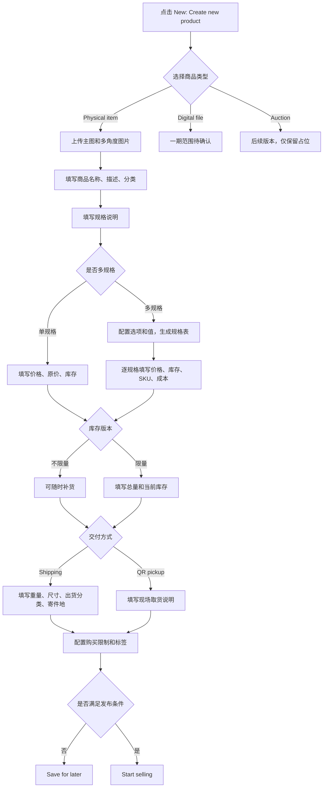
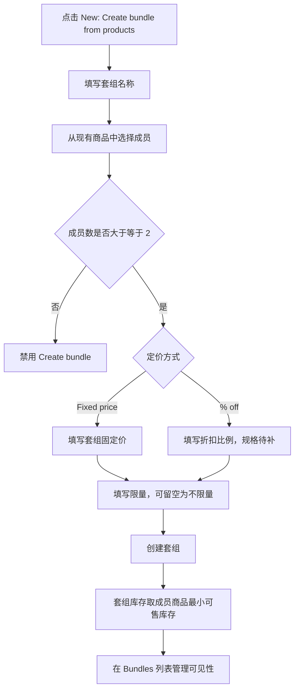
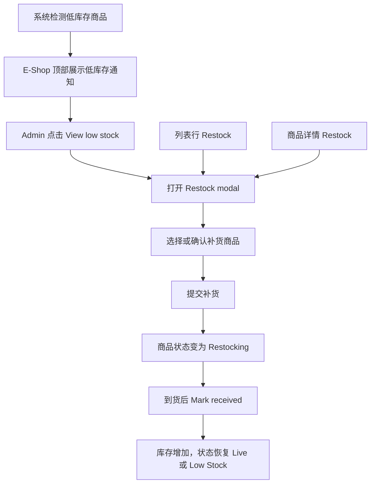
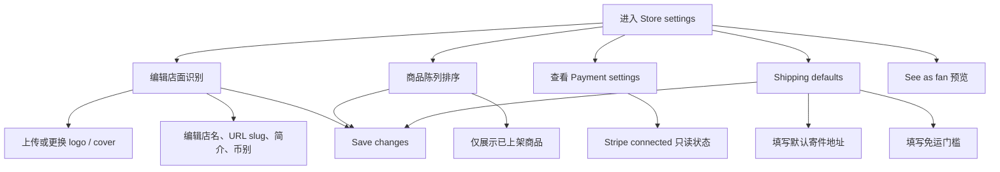

# Ztor Creator Studio e-shop 业务流程图

更新时间：2026-06-16
创建人：jaskang

信息来源：

- 需求页：https://aic-output.vercel.app/ztor/ztor-eshop-wireframe-2026-06-11.html
- 原型页：https://ztor-v2-creator-studio.vercel.app/e-shop.html
- 原型关联页：`create-product.html`、`product-detail.html`、`create-bundle.html`、`store-settings.html`

适用范围：Creator Studio 第一期 e-shop 功能。本文重点描述内部运营后台的业务流、权限流、商品发布流和一期依赖边界。买家端、支付、履约只作为 e-shop 闭环依赖，不在本文展开页面级实现。

## 1. 一期业务目标

Creator Studio 第一期以“内部运营代创作者管理店铺”为核心：

- Admin 在 Creator Studio 创建创作者资料，系统同步生成该创作者的 eShop。
- Admin 选择某个创作者后，进入该创作者作用域下的商品、套组、商店设置、补货和预览能力。
- 已发布且开启 Shop 可见的商品进入买家端店铺展示。
- 买家下单后生成订单，库存和销售数据回流到 Creator Studio 的订单、报表或收入模块。

范围差异需要产品确认：

- 需求页的 D4 已决策为“实体商品 + bundles only”，排除虚拟商品、音乐、活动票、会员卡。
- 原型中保留了 Digital file 和 Auctions 入口，其中 Auctions 已明确为 later release。
- 本文默认一期实现实体商品和套组；Digital file 仅作为原型遗留入口或后续能力，不进入一期主链路。

## 2. 总体业务闭环

关键约束：

- 商店创建发生在 Creator Studio，创建创作者资料时自动生成，不在 BO 单独建店。
- 只有 Published shop 和已开启 Shop 可见的商品会进入买家端展示。
- Fiat 支付对 Ztor 是新增链路，首期按 Stripe；POPCORN 购买复用既有流程。
- 一期不做退款；POPCORN 收入兑付为现金以外的结算方案暂缓。
- QR 取货是需求页标记的 blocker，需要进一步明确 token、刷新频率、核销角色和异常处理。

## 3. 角色和权限流

权限口径：

| 角色 | 一期权限 | 说明 |
| ---- | -------- | ---- |
| Admin | 可查看创作者列表；选择创作者后代运营该创作者店铺 | Admin 没有跨创作者的商品全局视图，必须先选择创作者 |
| Creator | Phase 2 自助入口；仅能管理自己的 Product / Orders / Reports | 一期由内部运营代操作 |
| Buyer | 买家端浏览和购买 | 不进入 Creator Studio |

## 4. 商品发布和可见性状态

状态说明：

- `Draft`：保存但未对粉丝可见。
- `Live`：满足发布条件并开启 Shop 可见。
- `Hidden`：商品仍存在，但不在粉丝端展示。
- `Low Stock`：由库存和低库存阈值推导，用于提醒运营补货。
- `Restocking`：补货流程已提交，等待到货确认。
- `Sold Out`：库存为 0，不可购买。

## 5. 商品创建流程

发布条件建议按原型 readiness 收敛：

- 商品名称、描述、分类。
- 主图。
- 价格。
- 库存或规格库存。
- 实体商品的配送或取货配置。
- 若开启每人限购，需要填写最大购买量。

## 6. 套组创建流程

## 7. 补货和低库存流程

## 8. 店铺设置流程

## 9. 系统边界和依赖

| 边界 | 业务含义 | 一期处理 |
| ---- | -------- | -------- |
| User DB | Ztor 单一身份体系 | 复用现有用户，不建独立 artist auth |
| creator_profile | 创作者实体，关联 user_id 和 handle | Creator Studio 创建，eShop 自动生成 |
| Commerce module | Shop、Product、Inventory、Order | 复用 Beamco commerce module，API 规格需补齐 |
| Creator Studio gateway | Creator Studio 调 commerce 的服务边界 | 由 Beamco team 负责 |
| Ztor client API gateway | 买家端调 commerce 的服务边界 | 由 Ztor team 负责 |
| Stripe | 新增 Fiat 支付链路 | 首期 Stripe only |
| POPCORN | 既有虚拟币购买流程 | 复用现有链路，只新增 merch 购买场景 |
| QR pickup | 现场取货核销 | 需求已标 blocker，需要方案确认 |
| Posts service | Feed 商品卡片 | 新增 product-card attachment，非 Creator Studio 一期核心页面 |

## 10. 待确认问题

1. 一期是否严格按需求页 D4 只做实体商品和套组，还是保留 Digital file 创建能力。
2. Creator registration approval 是否需要一期审批流。
3. Stripe Connect、平台抽佣比例、结算币别和 payout schedule 是否只在 Earnings 维护。
4. QR pickup 的 token 生成、刷新、核销、过期和异常补核销规则。
5. Commerce module API 是否已有 Product、Bundle、Inventory、Order、Store settings 的正式字段规格。
6. Orders / Reports 是否属于本期 Creator Studio e-shop 页面交付，还是仅作为后续入口。
